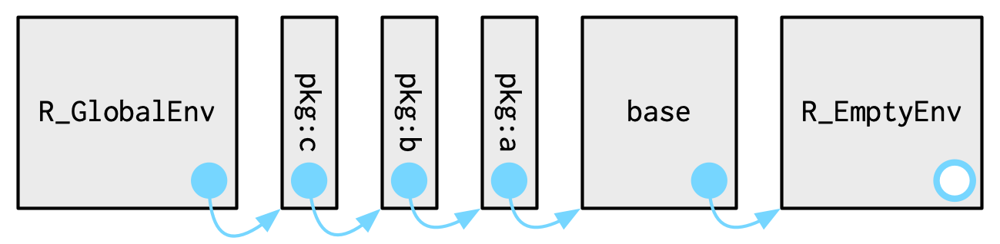

# Environments

**Learning objectives:**

- Understanding enviroments is not necesary for day-to-day use of R
- Learn how enviroments are used to implement scoping
- Learn about important and special enviroments
- Learn about the super assignment

## Enviroment basics

They're the data structure that powers scoping: it's where we look for objects.

They look like a list but have four important differences: 

- Every name must be unique
- Names are not ordered
- An enviroment has a parent
- Enviroments are not copied when modified

**What do they do?**

They **bind** a set of names with a set of values.


They can even bind themselves!

## Important enviroments


```{r ch7_setup, message = FALSE, warning = FALSE}
library(rlang)
library(glue)
```

- Current environment: Enviroment in which code is currently executing. `current_env()`, accessed with `enviroment()`
- Global environment: Where all interactive computation takes place. Also called **workspace**. `global_env()` accessed with `globalenv()`

```{r}
current_env()

f <- function() {
  print("Env inside a function")
  print(current_env())
}

f()
```

**Parents**


Every enviroment has a parent, another enviroment.  If a lookup fails in `current_env()`, R will look in the parent. 

```{r}
env_parents(current_env())
```

The only enviroment that doesn't have a parent: the empty enviroment

```{r error=TRUE}
parent.env(empty_env())
```

**:(**

## The super asignment

`<-` creates a variable in the current enviroment. 
 
`<<-`  modifies an existing variable in the parent enviroment OR creates a new one in `.GlobalEnv`

```{r}
a <- 3
f <- function (){
  a <- 5
  a <<- 10
  b <<- 8
  print("Oops! I've modified variables outside my scope")
  glue("The value of my a = {a}")
}
f()
glue("The value of .GobalEnv's a = {a}")
glue("The value of .GobalEnv's b = {b}")
```

Those variables can be also accessed like this: 

```{r}
ge <- global_env()
ge$a
ge[["b"]]
```

or 

```{r}
env_get(ge, "a")
```

To check if an enviroment has a binding: 

```{r}
env_has(ge, "c")
env_has(ge, "b")
```

`ge[[1]]` will not work because elements have no order. 

## Special enviroments

### Package enviroments

Every package attached becomes a parent of `.GlobalEnv`. In order: last one attached, first parent. 

Together, they form the **search path**



```{r}
search()
```

Last two are always the same: 

- `Autoloads`: to load package objects, like datasets, only when needed.
- `package:base`: the enviroment of the base package.

### Function enviroments

The enviroment where a function is created. It is bound by the function. 

Functions in R are also called **closures** because they capture or enclose their enviroment. 

Function with `.GlobalEnv` as its function enviroment, with its name binded in global:

```{r}
f_in_global <- function(x) x+3
fn_env(f_in_global)
env_has(global_env(), "f_in_global")
```

Function with `.GlobalEnv` as its function enviroment, with its name binded in some other enviroment:

```{r}
e <- env()
e$function_in_e <- function() 37
fn_env(e$function_in_e)
env_has(global_env(), "function_in_e")
env_has(e, "function_in_e")
```

Does it matter? Yes, because it changes the way functions find their variables.

### Namespaces

<details>
<summary>*If the parent environment of a package varies based on what other packages have been loaded. Does that mean that the package will find different functions if packages are loaded in a different order?*</summary>
No! Thanks to *namespaces*
</details>


**Important for package developers**

Every function *in a package* is associated with two enviroments: the package environment and the namespace. 

- The package enviroment is the external interface, the namespace is the internal implementation
- The package environment controls how we find the function; the namespace controls how the function finds its variables.

namespaces have two ancestors: 

- the **imports** enviroments: controlled by the package developer in the `NAMESPACE` file
- the **base namespace**: so that packages can use any base function

### Execution environment
 
It is created every time a function is called to host execution, and garbage collected, once the function has completed.
The *fresh start* principle relies on them.

### Caller enviroment

The environment from which the function was called. It varies based on how the function is called, not how the function was created. 

We can see it by looking at the `traceback()`

## Other cool features about enviroments

- They avoid copies of large data. 
- They manage state within a package
- They act as a hashmap, so lookups take `O(1)`


## Meeting Videos

### Cohort 1

`r knitr::include_url("https://www.youtube.com/embed/mk7iu1-P8ZU")`

### Cohort 2

`r knitr::include_url("https://www.youtube.com/embed/syRMRYKN30k")`

### Cohort 3

`r knitr::include_url("https://www.youtube.com/embed/fW7Di01gLhw")`

### Cohort 4

`r knitr::include_url("https://www.youtube.com/embed/Aw_Q7PMYJkA")`

### Cohort 5

`r knitr::include_url("https://www.youtube.com/embed/tuafimbMyKk")`

### Cohort 6

`r knitr::include_url("https://www.youtube.com/embed/buUaaOu89EQ")`

<details>
<summary> Meeting chat log </summary>

```
00:08:41	Arthur Shaw:	Hello, everyone!
00:21:31	Federica Gazzelloni:	?walk: Apply a function to each element of a list or atomic vector
00:23:15	Federica Gazzelloni:	?caller_env: Get properties of the current or caller frame
00:24:56	Trevin:	purrr::walk(x, function(x, ce, ace = rlang::caller_env()) {
  .ce <- rlang::caller_env()
  message("Internal: ")
  print(.ce)
  message("Argument: ")
  print(ace)
  message("External: ")
  print(ce)
  message("Internal: ",paste0(ls(.ce), collapse = "\n"))
  message("Argument: ",paste0(ls(ace), collapse = "\n"))
  message("External: ",paste0(ls(ce), collapse = "\n"))
}, ce = rlang::caller_env())
00:29:39	Federica Gazzelloni:	??iwalk: Apply a function to each element of a vector, and its index
00:35:30	Arthur Shaw:	https://magrittr.tidyverse.org/reference/tee.html
00:36:05	Federica Gazzelloni:	?`%T>%`
00:46:59	Trevin:	?eval
01:06:03	Federica Gazzelloni:	https://cran.r-project.org/web/packages/withr/index.html
01:09:21	Federica Gazzelloni:	https://github.com/r-lib/withr
01:10:38	Trevin:	I'm okay if we meet next week
01:10:53	Oluwafemi Oyedele:	I am ok with next week
```
</details>

### Cohort 7

`r knitr::include_url("https://www.youtube.com/embed/PUXrijnsWy0")`

<details>
<summary>Meeting chat log</summary>
```
00:06:49	Ryan Honomichl:	https://r4ds.github.io/bookclub-Advanced_R/QandA/docs/environments.html
```
</details>

`r knitr::include_url("https://www.youtube.com/embed/6xECnY4ro48")`

<details>
<summary>Meeting chat log</summary>
```
00:14:44	collinberke:	https://ivelasq.rbind.io/blog/macos-rig/index.html
00:21:10	collinberke:	https://github.com/tidyverse/dplyr/blob/main/NAMESPACE
01:00:21	collinberke:	https://r4ds.hadley.nz/iteration.html
```
</details>
